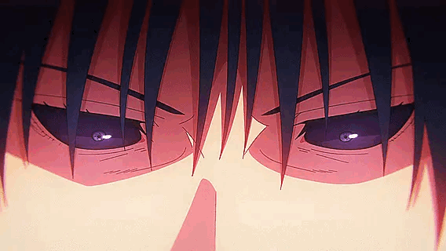
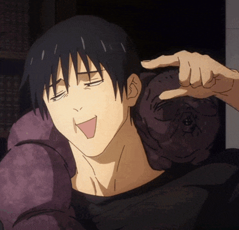

  

 

<table align="center" width="100%" border="0">
  <tr>
    <td width="220" align="center" valign="middle">
      
    </td>
    <td valign="middle">
      <h1>
        
        Hey, I'm Jude
      </h1>
      <h3>
        
      </h3>
    </td>
  </tr>
</table>

 

<h2 align="center">⚔️ Cursed Tools / Arsenal</h2>

  
  
  
  
  
  

  
  
  
  
  
  

 

<h2 align="center">📊 Battle Record</h2>

  
  

  

  

  
  
  

 

<picture>
  <source media="(prefers-color-scheme: dark)" srcset="https://raw.githubusercontent.com/Jude-sigma/Jude-sigma/output/snake-dark.svg" />
  <source media="(prefers-color-scheme: light)" srcset="https://raw.githubusercontent.com/Jude-sigma/Jude-sigma/output/snake.svg" />
  
</picture>

 

  

 

  

<i>「 動かないものは斬れない 」 — Toji</i>

